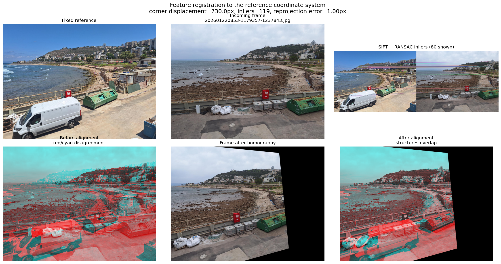
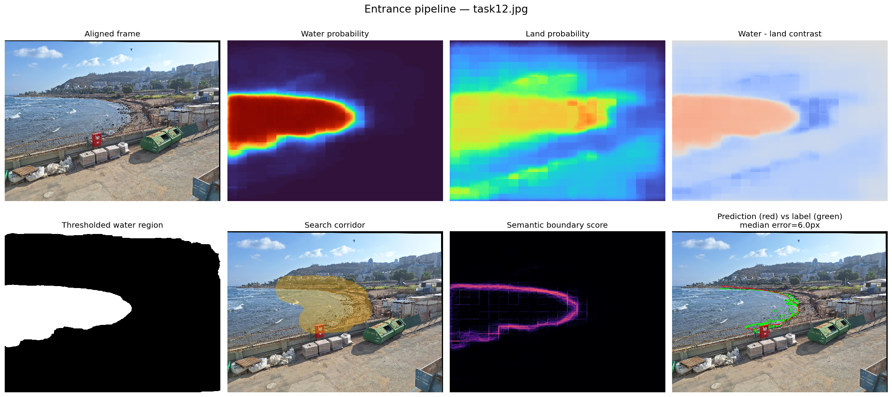
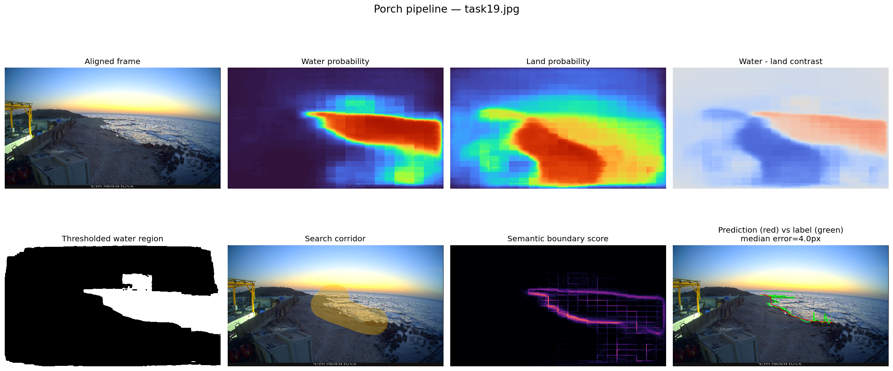

# Yam Yabasha

Semi-automatic shoreline extraction for fixed coastal cameras. Each incoming
frame is aligned to a location reference, segmented into water and land with
CLIPSeg, and converted into a connected shoreline inside a broad user-selected
search area.


The user marks an approximate area once per camera. The hint limits **where**
the algorithm searches; it does not prescribe the line, its direction, or
which side contains water. Full two-dimensional contours support curved and
locally vertical shorelines without a `side` parameter, transects, greedy
search, or dynamic programming.

## Visual pipeline

### 1. Register every frame to its fixed reference

SIFT detects repeatable points in the reference and incoming frame. Descriptor
matching proposes correspondences, RANSAC rejects outliers, and a homography
warps the complete frame into reference coordinates. The example below uses a
real frame with approximately 730 px mean corner displacement. Registration
still reaches 119 inliers and about 1 px inlier reprojection error.



Black areas after warping are outside the incoming frame's valid field of view.
The red/cyan overlays emphasize disagreement; correctly aligned static
structures overlap, while genuine scene changes such as water level and moving
objects remain different.

### 2. Build water and land semantics, then extract the boundary

CLIPSeg predicts one map per text prompt. Water prompts and land prompts are
combined separately, and the signed contrast is:

```text
contrast = Pwater - Pland
```

The current validated default, `contrast_threshold = -0.05`, produces the
binary water region. Gradient strength and nearby support from both semantic
classes form a boundary score. Full-image contours are extracted first and
clipped to the user's search corridor only afterwards, preventing the corridor
edge from becoming a false shoreline.

Entrance example selected from six labeled frames:



Porch example selected from six labeled frames:



In the final panels, red is the prediction and green is the registered manual
water-mask boundary. Each example was selected automatically as the lowest
median boundary-error result among six labeled frames for that location.

The complete method is documented in
[docs/ALGORITHM.md](docs/ALGORITHM.md), with parameter guidance in
[docs/CONFIGURATION.md](docs/CONFIGURATION.md).

## Interactive inspection

Open
[`notebooks/01_shoreline_parameter_playground.ipynb`](notebooks/01_shoreline_parameter_playground.ipynb)
to inspect registration, every individual prompt map, combined water/land
probabilities, contrast, morphology, ROI, boundary evidence, candidate ranking,
and the selected contour. It also includes fast threshold/radius sweeps and an
optional multi-image preview.

```powershell
python -m pip install -e ".[notebook]"
```

CLIPSeg is run once per selected image; contour parameters can then be changed
and compared without rerunning the model.

## Pipeline

1. Register the frame to `reference.jpg` with SIFT, matching, and RANSAC.
2. Predict individual CLIPSeg maps for water and land prompts.
3. Build `contrast = Pwater - Pland`.
4. Compute semantic water/land boundary evidence over the full image.
5. Extract full 2D contours.
6. Clip contours to the user's broad search corridor.
7. Score connected candidates by semantic evidence and length.
8. Smooth and export the selected shoreline in reference coordinates.

## Installation

Python 3.10 or newer is required.

```powershell
git clone https://github.com/Nir-David-Duani/yam-yabasha.git
cd yam-yabasha
python -m venv .venv
.\.venv\Scripts\Activate.ps1
python -m pip install --upgrade pip
python -m pip install -e .
```

CLIPSeg weights are downloaded from Hugging Face on the first run and then
loaded from the local cache.

## Recommended guided workflow

Place the camera files in the layout shown below, then run a small end-to-end
test that redraws both hints and processes five images per location:

```powershell
yam-yabasha workflow --redraw-hints --max-images 5
```

The command opens the Entrance reference and then the Porch reference in
external Matplotlib windows. Left-click to add hint points, right-click to undo,
and press Enter (or middle-click) to save. CLIPSeg is loaded once and reused for
every frame. A failure in one frame is reported without stopping the remainder.

The CLI auto-detects the repository when launched either from the project
folder or from its direct parent. From any other folder, pass
`--project-root "path\to\yam-yabasha"` before the `workflow` command.

Once the hints look correct, process every image:

```powershell
yam-yabasha workflow --reuse-hints
```

Other useful modes:

```powershell
yam-yabasha workflow
yam-yabasha workflow --reuse-hints --max-images 20
yam-yabasha workflow --locations entrance --redraw-hints
```

- Plain `workflow` asks whether to reuse or redraw each existing hint.
- `--max-images` applies separately to each location.
- `--locations entrance` runs only the Entrance camera.

## Location setup

Each fixed camera has its own folder:

```text
data/
  entrance/
    reference.jpg
    shoreline_hint.json
    reference_roi_mask.png  # optional, registration only
  porch/
    reference.jpg
    shoreline_hint.json

Test/
  entrance/
    frame_001.jpg
    frame_002.jpg
  porch/
    frame_001.jpg
    frame_002.jpg
```

The repository tracks the two references and saved hints. Raw image collections
and labels are intentionally excluded from Git, so a new user must copy test
frames into the corresponding `Test/<location>/` folders.

To create or replace the coarse hint for one location:

```powershell
yam-yabasha annotate --location entrance
```

An external Matplotlib window opens. Left-click several rough points through the
area in which the shoreline may occur, right-click to undo the last point, and
press Enter (or middle-click) to save. Closing the window cancels when fewer
than two points were selected. The corridor should include realistic shoreline
movement; it does not need to follow the shoreline accurately.

## Run inference

One image:

```powershell
yam-yabasha run --location entrance --image "Test\entrance\202508191322-1179357-1179357.jpg"
```

A folder:

```powershell
yam-yabasha batch --location porch --input "Test\porch" --max-images 20
```

Useful experiment overrides:

```powershell
yam-yabasha run --location entrance --image "path\to\frame.jpg" --corridor-radius 140 --contrast-threshold 0.05 --water-prompt "sea water" --water-prompt "foamy water" --land-prompt "sand" --land-prompt "rocky shore"
```

`--no-registration` is intended for a reference image or a frame already in
reference coordinates. Registration failure stops normal inference instead of
silently applying the ROI at the wrong coordinates.

## Python API

```python
from pathlib import Path

from yam_yabasha import PipelineConfig, ShorelinePipeline

config = PipelineConfig(project_root=Path("."))
pipeline = ShorelinePipeline(config)
result = pipeline.process(
    "Test/entrance/example.jpg",
    location="entrance",
)

xy = result.shoreline.points
confidence = result.shoreline.confidence
```

The result also exposes registration diagnostics, prompt maps, the corridor,
all contour candidates, and the boundary score. These objects are suitable for
the planned GUI without changing the algorithm.

## Outputs

Each processed frame receives a self-contained output folder:

```text
outputs/<location>/<image-name>/
  aligned.jpg
  water_probability.png
  land_probability.png
  contrast.png
  boundary_score.png
  corridor.png
  shoreline.csv
  pipeline.png
  metadata.json
```

Open all generated results on Windows with:

```powershell
explorer .\outputs
```

Start with `pipeline.png` for a visual summary. Use `aligned.jpg` to verify
registration, the probability/contrast images to diagnose semantics,
`shoreline.csv` for downstream measurements, and `metadata.json` for
registration quality and candidate counts.

## Project structure

```text
src/yam_yabasha/
  config.py          typed parameters
  registration.py    SIFT/ORB/AKAZE + RANSAC
  segmentation.py    CLIPSeg water/land maps
  roi.py             user hint corridor
  shoreline.py       2D contour extraction and scoring
  pipeline.py        public end-to-end API
  visualization.py   output overlays and stage figures
  cli.py             annotation and inference commands
docs/                 algorithm and parameter documentation
notebooks/            full visual parameter playground
scripts/              reproducible documentation assets
tests/                synthetic unit tests
```

## Verification

```bash
python -m pip install -e ".[dev]"
python -m pytest
```

The tests cover prompt aggregation, hint storage, ROI construction, cyclic
contour clipping, curved shoreline extraction, ROI-border rejection, empty
results, and geometric warping.

## Scope and limitations

- The workflow assumes a fixed camera or a frame that can be registered
  reliably to a fixed reference.
- Every new camera location needs its own reference and coarse hint.
- CLIPSeg is zero-shot; unusual lighting, foam, reflections, occlusions, and
  severe weather can change the semantic maps.
- Registration failure stops normal inference rather than applying a
  reference-frame ROI at incorrect coordinates.
- A confidence score ranks candidates within one frame; it is not a calibrated
  probability of correctness.

## Data and Git

Large local image collections under `Test/`, `data/*/images/`, and
`data/*/masks/` are ignored by Git. Camera references, hint JSON files, source
code, tests, documentation, and README figures remain trackable. Keep a
separate backup of raw datasets before removing any older project folder.

Before committing a notebook after experimentation, remove embedded outputs:

```powershell
python -m pip install -e ".[notebook]"
python scripts/strip_notebook_outputs.py notebooks/01_shoreline_parameter_playground.ipynb
```

README image regeneration is a maintainer workflow and requires the ignored
`data/<location>/images/task*.jpg`, matching
`data/<location>/masks/task-####.png`, and `Test/entrance/` collections:

```powershell
python scripts/generate_readme_assets.py
```
